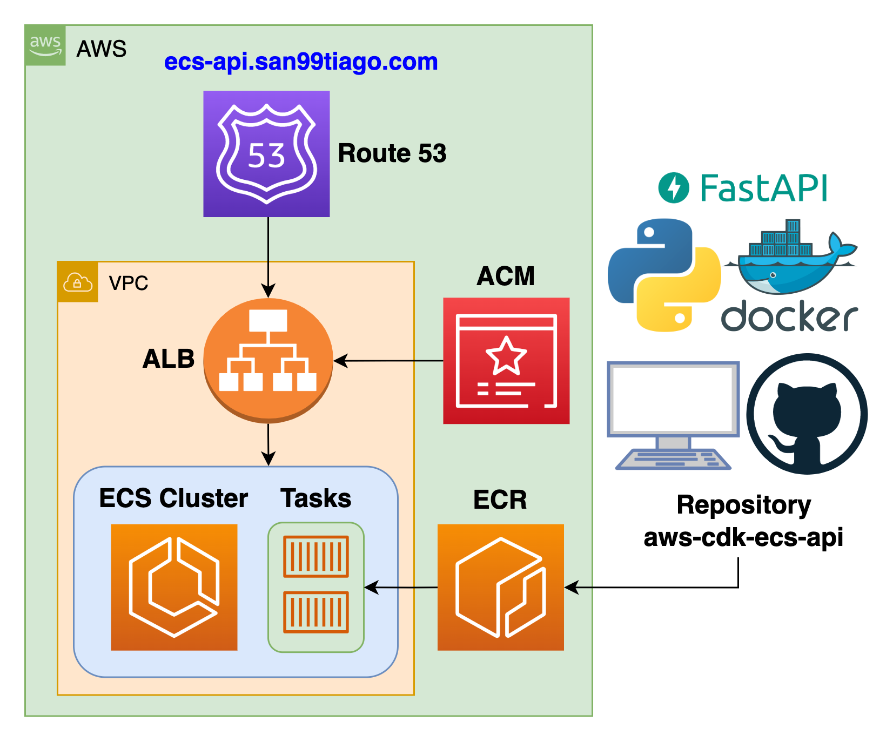

# aws-cdk-ecs-api

- [aws-cdk-ecs-api](#aws-cdk-ecs-api)
  - [Overview](#overview)
  - [AWS Architecture Diagram](#aws-architecture-diagram)
  - [Folders Explained](#folders-explained)
  - [Usage](#usage)
    - [Clone the repository](#clone-the-repository)
    - [Configure Python](#configure-python)
    - [Configure CDK](#configure-cdk)
  - [Dependencies](#dependencies)
    - [Software](#software)
    - [Tools](#tools)
  - [Special thanks](#special-thanks)
  - [Author](#author)
  - [LICENSE](#license)

## Overview

AWS FastAPI CDK deployment on top of ALB and ECS with Docker containers implementing ECS as the orchestration tool for an AWS-managed infrastructure.

- Deployed on AWS with Infrastructure as Code on [CDK-Python](https://aws.amazon.com/cdk/).
- API developed with [FastAPI](https://fastapi.tiangolo.com/lo/).
- Unit and Integration Tests for the source code with [PyTest](https://docs.pytest.org/en/latest).
- Containerized solution with [Docker](https://www.docker.com) orchestrated by [Amazon ECS](https://aws.amazon.com/ecs/) (Fargate).
- Load Balancing managed with [ELB - Application Load Balancer](https://docs.aws.amazon.com/elasticloadbalancing/latest/application/introduction.html) with listener ECS Service as target group.
- Public DNS records on top of [Route 53](https://aws.amazon.com/route53/) with Certificates on [AWS Certificate Manager](https://aws.amazon.com/certificate-manager/).

## AWS Architecture Diagram

The AWS infrastructure solution is deployed with CDK-Python with the resources defined on the `cdk` folder:

 <br>

## Folders Explained

This repository consists of multiple folders/files, which are explained as follows:

- Infrastructure as Code ([`./cdk/`](./cdk/)).
- Source Code ([`./src/app/`](./src/app/)).
- Tests ([`./tests/`](./tests/))
- Docker containerization ([`./src/Dockerfile`](./src/Dockerfile)).

## Usage

Follow these steps to configure the project locally:

### Clone the repository

First, clone the repository:

```bash
git clone https://github.com/san99tiago/aws-cdk-ecs-api
cd aws-cdk-ecs-api
```

### Configure Python

Review the step by step commands for the source code (Python) development and testing at:

- [`./commands_python.sh`](./commands_python.sh)

> Note: python dependencies for this project are managed by [Poetry](https://python-poetry.org). Review [`./pyproject.toml`](pyproject.toml) for details.

### Configure CDK

Review the step by step commands for configuring the CDK at:

- [`./commands_cdk.sh`](./commands_cdk.sh)

> Note: for deploying or destroying the solution, see ("part 3") inside [`./commands_cdk.sh`](./commands_cdk.sh).

## Dependencies

### Software

- [Visual Studio Code](https://code.visualstudio.com/) <br>
  Visual Studio Code is my main code editor for high-level programming. This is not absolutely necessary, but from my experience, it gives us a great performance and we can link it with Git and GitHub easily. <br>

- [NodeJs](https://nodejs.org/en/) <br>
  NodeJs is a JavaScript runtime built on Chrome's V8 JavaScript engine programming language. The community is amazing and lets us handle async functionalities in elegant ways. <br>

- [Python](https://www.python.org/) <br>
  Python is an amazing dynamic programming language that let us work fast, with easy and powerful integration of different software solutions. <br>

### Tools

- [CDK CLI (Toolkit)](https://docs.aws.amazon.com/cdk/v2/guide/cli.html) <br>
  To work with the CDK, it is important to install the main toolkit as a NodeJs global dependency. Please refer to the official AWS [Getting started with the AWS CDK](https://docs.aws.amazon.com/cdk/v2/guide/getting_started.html)<br>

- [AWS CLI](https://aws.amazon.com/cli/) <br>
  The AWS Command Line Interface (AWS CLI) is a unified tool to manage your AWS services. We will use it for connecting to our AWS account from the terminal (authentication and authorization towards AWS). <br>

## Special thanks

- I am grateful to the talented individuals who have dedicated their time and effort to develop the exceptional open-source projects that have been used in the creation of this solution. <br>

## Author

**Santiago Garcia Arango**

<table border="1">
    <tr>
        <td>
            <p align="center"></p>
        </td>
        <td>
            <p align="center">As a curious DevOps Engineer, I am deeply passionate about implementing cutting-edge cloud-based solutions on AWS.<br> I firmly believe that today's greatest challenges must be solved by the expertise of individuals who are truly passionate about their work.
            </p>
        </td>
    </tr>
</table>

## LICENSE

Copyright 2023 Santiago Garcia Arango
